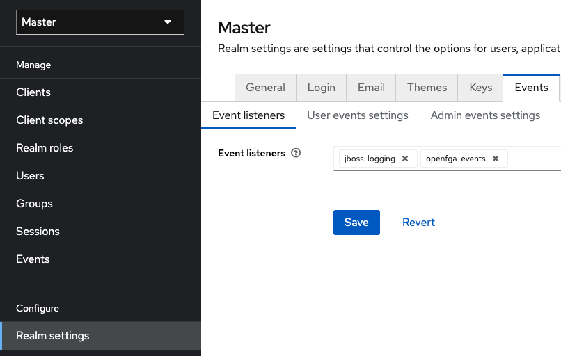
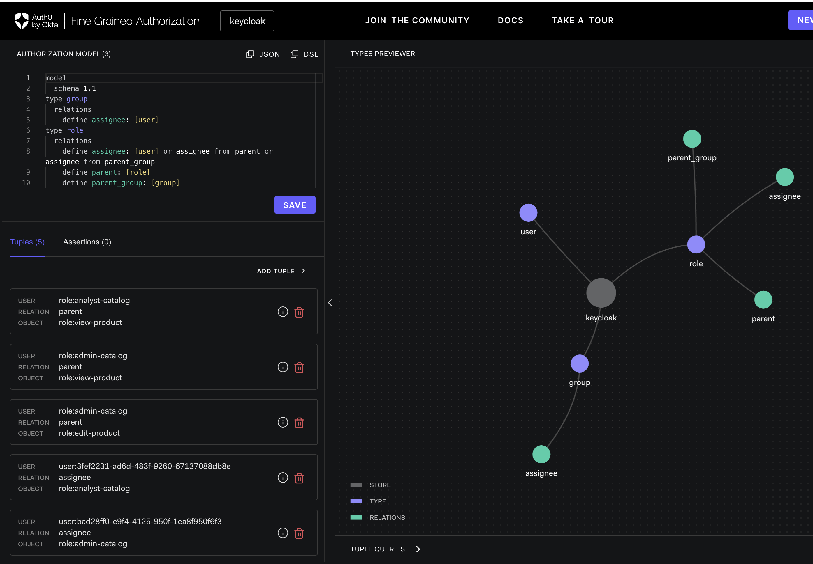
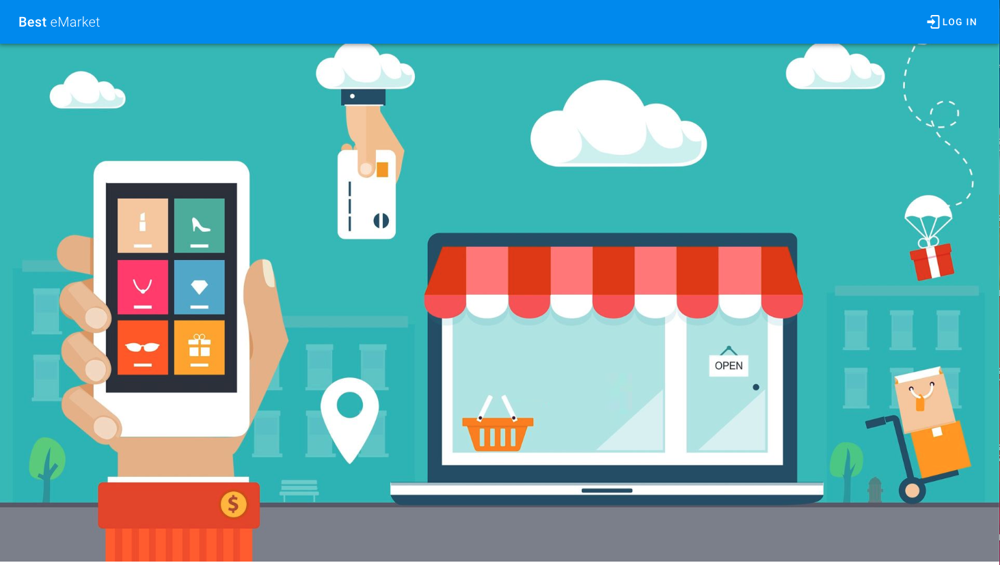
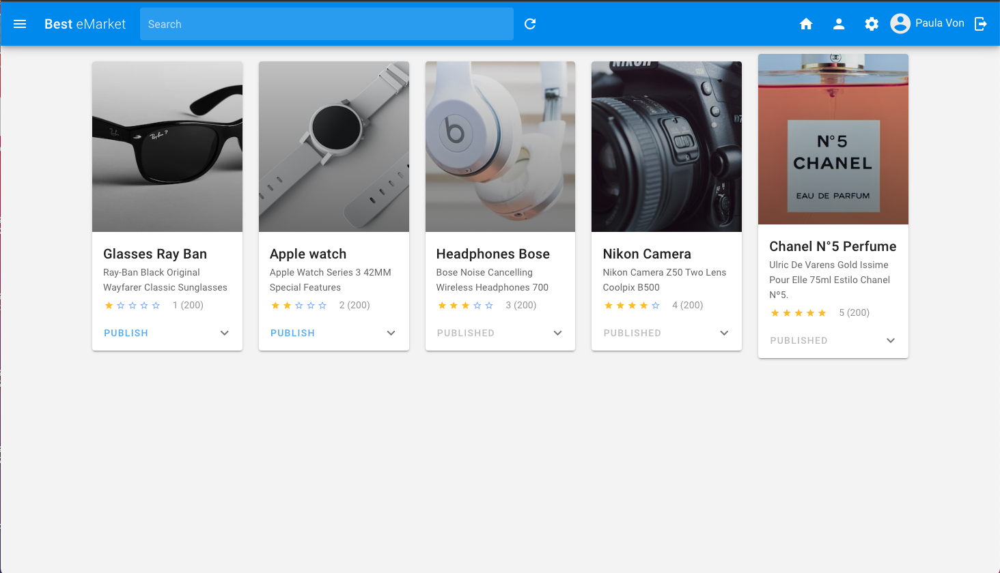
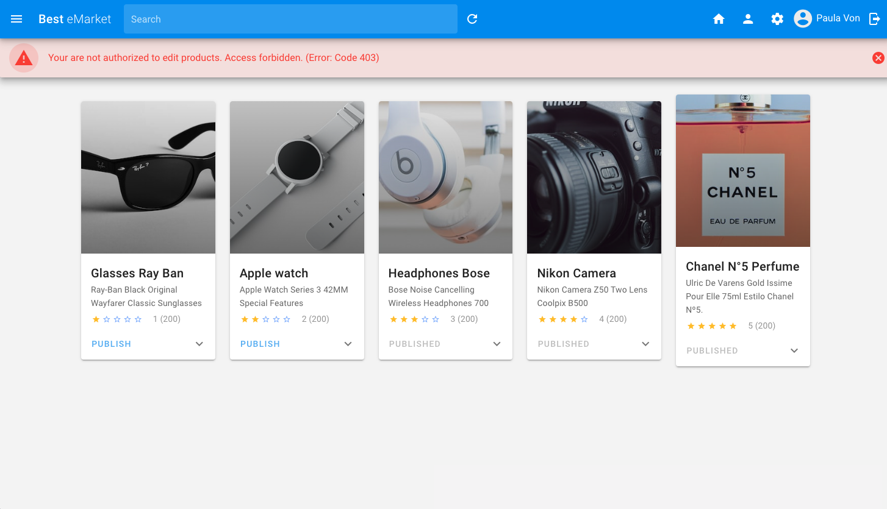
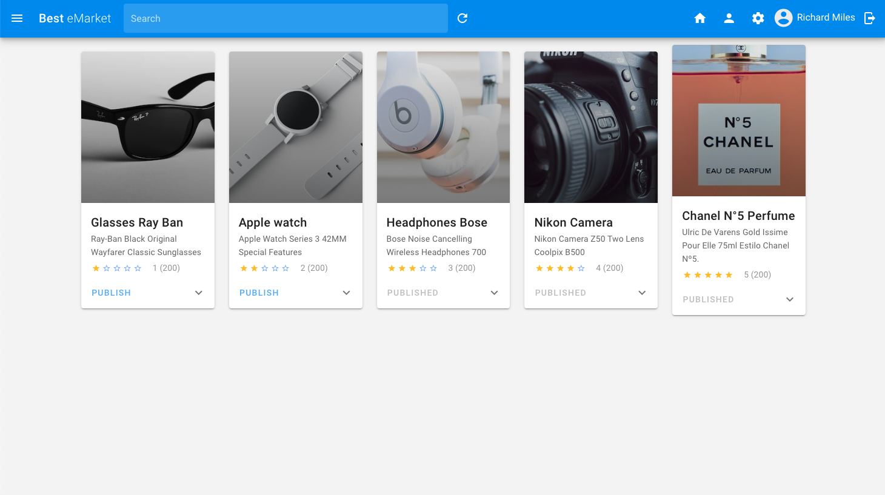
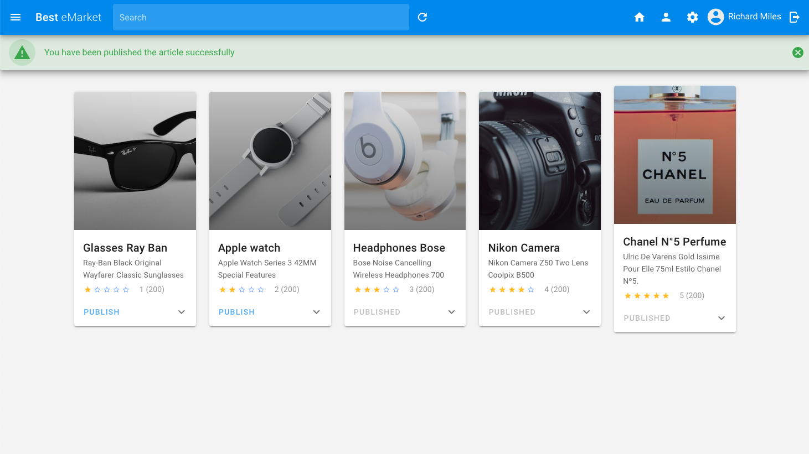
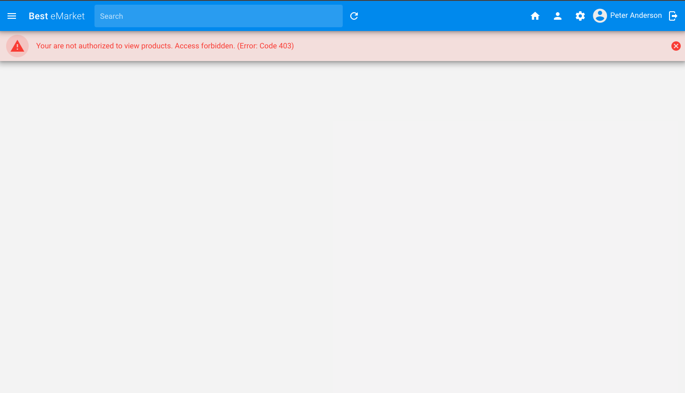

# Keycloak integration with OpenFGA (based on Zanzibar) for Fine-Grained Authorization at Scale (ReBAC)
This repository contains a PoC implemented with [Keycloak](https://www.keycloak.org/) integrated with [OpenFGA](https://openfga.dev/) on demostrating how to apply fine-grained access (FGA) control in a high performance and flexible authorization.

In this new version of the PoC we have a direct integration between the Access Manager platform and the OpenFGA solution thanks to the use of the [OpenFGA Java SDK](https://github.com/openfga/java-sdk) to publish the events.

This workshop is based the following article [Keycloak integration with OpenFGA (based on Zanzibar) for Fine-Grained Authorization at Scale (ReBAC)](https://embesozzi.medium.com/keycloak-integration-with-openfga-based-on-zanzibar-for-fine-grained-authorization-at-scale-d3376de00f9a). You will find there full details about the authorization architecture guidelines and involved components.


## Authorization Framework (New)

The following diagram illustrates the solution architecture of this workshop:

<p align="center">
  
</p>

* Core:
    * Keycloak is responsible for handling the authentication with the standard OpenID Connect and manages user access with its Role Model.
    * Keycloak is configured with a new custom extension ❤️: [keycloak-openfga-event-publisher](https://github.com/embesozzi/keycloak-openfga-event-publisher)
      * Listens to the Keycloak events (User Role Assignment, Role to Role Assignment, etc).
      * Parses this event into an OpenFGA tuple key based on the [Keycloak Authorization Schema](model.dsl).
      * Publishes them to OpenFGA over HTTP using the [OpenFGA Java SDK](https://github.com/openfga/java-sdk).
    * OpenFGA is responsible for applying fine-grained access control. The OpenFGA service answers authorization checks by determining whether a relationship exists between an object and a user.
* Other components
    * Store Web Application is integrated with Keycloak by OpenID Connect
    * Store API is protected by OAuth 2.0 and it utilizes the OpenFGA SDK for FGA


# How to install?
## Prerequisites

 * Install Git, [Docker](https://www.docker.com/get-docker) and [Docker Compose](https://docs.docker.com/compose/install/#install-compose) in order to run the steps provided in the next section<br>

## Deploy the PoC

1. Clone this repository
    ````bash
    git clone https://github.com/embesozzi/keycloak-openfga-workshop
    cd keycloak-openfga-workshop
    ````

2. Execute following Docker Compose command to start the deployment

   ```sh
   docker-compose -f docker-compose.yml -f docker-compose-apps.yml -f docker-compose-openfga.yml up
   ```

3. To be able to use this environment, you need to add this line to your local HOSTS file:

   ```sh
   127.0.0.1  keycloak openfga store store-api
   ```

4. Access the following web UIs using URLs bellow via a web browser.

    | Component                 |  URI                          |  Credential               | Image     |
    | ------------------------- |:-----------------------------:|:-------------------------:|:-----------:
    | Keycloak Console          |   http://keycloak:8081        |  admin / password         | quay.io/keycloak/keycloak:19.0.2 |
    | OpenFGA Playground        |   http://localhost:3000/playground  |                     | openfga/openfga:latest           | 
    | Store Portal              |   http://store:9090           |                           | Custom image                   |
    | Store API                 |   http://store-api:9091       |                           | Custom image                   |


## Post configuration steps

### OpenFGA
1. Import the [OpenFGA authorization schema for Keycloak](openfga/keycloak-authorization-model.json):
    ```bash
    cd openfga
    ./import.sh
    ```
2. As the result you will see the following OpenFGA Authorization Model in the [OpenFGA Playground Console](http://localhost:8080/playground) :

    

### Keycloak
1. Enable the Keycloak OpenFGA Event Listener extension in Keycloak:

    * Open [administration console](http://keycloak:8081)
    * Choose realm
    * Realm settings
    * Select `Events` tab and add `openfga-events-publisher` to Event Listeners.

    

2. Proceed to initialize the PoC:

    Execute the following [script](keycloak/initialize-poc.sh) to initialize the PoC:

    ```bash
    docker exec keycloak /bin/bash /opt/keycloak/initialize-poc.sh
    ```

    This script will create the OAuth Clients and the following Users and Role Model:

    

    The password for all the users is `demo1234!`

    Once these steps are finished, the Keycloak OpenFGA Event Publisher extension has proceed to send these events over HTTP to the OpenFGA solution. Here, are all tuples stored.

    | User                      |  Relation                     |  Object               | 
    | ------------------------- |:-----------------------------:|:---------------------:|
    | role:admin-catalog        |   parent                      |  role:view-product    |
    | role:analyst-catalog      |   parent                      |  role:view-product    |
    | role:admin-catalog        |   parent                      |  role:edit-product    |
    | user:paula                |   assignee                    |  role:analyst-catalog |
    | user:richard              |   assignee                    |  role:admin-catalog   |


    The users are identified by the value of the claim sub in the [OpenFGA Playground](http://localhost:3000/playground), see the Tuples tab:

    


3. Restart the apps (containers: `store` and `store-api`)

## Test cases
As an example, we will implement an Product Catalog web application that has the following requirements:
* Only authenticated user with MFA can access to the application
* Product can be viewed by their Analyst
* Product can be edited by their Admin
* Global Admin users can view or edit any Product

You can follow the test cases described in the [Keycloak integration with OpenFGA (based on Zanzibar) for Fine-Grained Authorization at Scale (ReBAC)](https://embesozzi.medium.com/keycloak-integration-with-openfga-based-on-zanzibar-for-fine-grained-authorization-at-scale-d3376de00f9a).

Nevertheless, the use cases are detailed below:

### Use case 1: Access to the Store for managing products as an Analyst (Paula)

1. Access to the [store web application](http://store:9090) store web application and proceed to login with Paula (paula / demo1234!) in Keycloak.
    
    

2. Keycloak will return the id_token and the access token to the application

3. The Store web application will show the product catalog

    3.1. The app will call the product API sending the access token in the Authorization header

    3.2. The API will apply the following steps:

    3.3. It will validate the token following the OAuth 2.0 standard and it will extract the claim sub to identify the user

    3.4. Then it will call the OpenFGA API to check if the user has the view-product role with the relationship assignee

    3.5. OpenFGA will return the response “allowed”

    3.6. The API will return the product information and the Store web app will show the product catalog to the user
    
    

4. Try to publish a product by clicking the button "Publish" but you will see that Paula is not allowed

    4.1. The app will call the product API sending the access token in the Authorization header

    4.2. The API will apply the following steps:

    4.3. It will validate the token following the OAuth 2.0 standard and it will extract the claim sub to identify the user

    4.4. Then it will call the OpenFGA API to check if the user has the edit-product role with the relationship assignee

    4.5. OpenFGA will return the response “denied”

        

### Use case 2: Access to the Store for managing products as an Admin (Richard)

1. Access to the [store web application](http://store:9090) store web application and proceed to login with Richard (richard / demo1234!) in Keycloak.
    
    

2. Keycloak will return the id_token and the access token to the application

3. The store web application will show the product catalog

    

4. Try to publish a product by clicking the button "Publish" but you will see that Richard is allowed

    


### Use case 3:  Access to the Store for managing products as an Regular User (Peter)

1. Access to the [store web application](http://store:9090) store web application and proceed to login with Peter (peter / demo1234!) in Keycloak.
    
    

2. Keycloak will return the id_token and the access token to the application

3. The store web application will try to the products show but the user is not allowed

    
